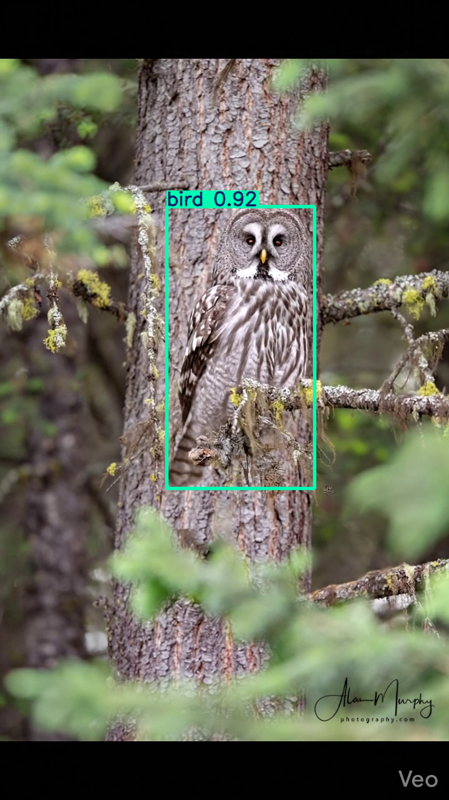
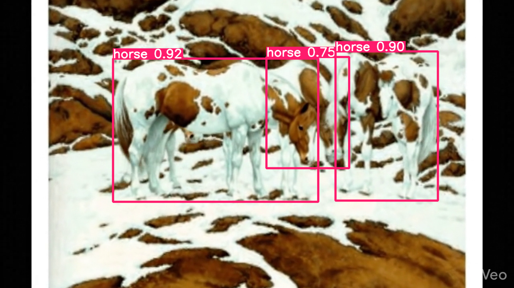
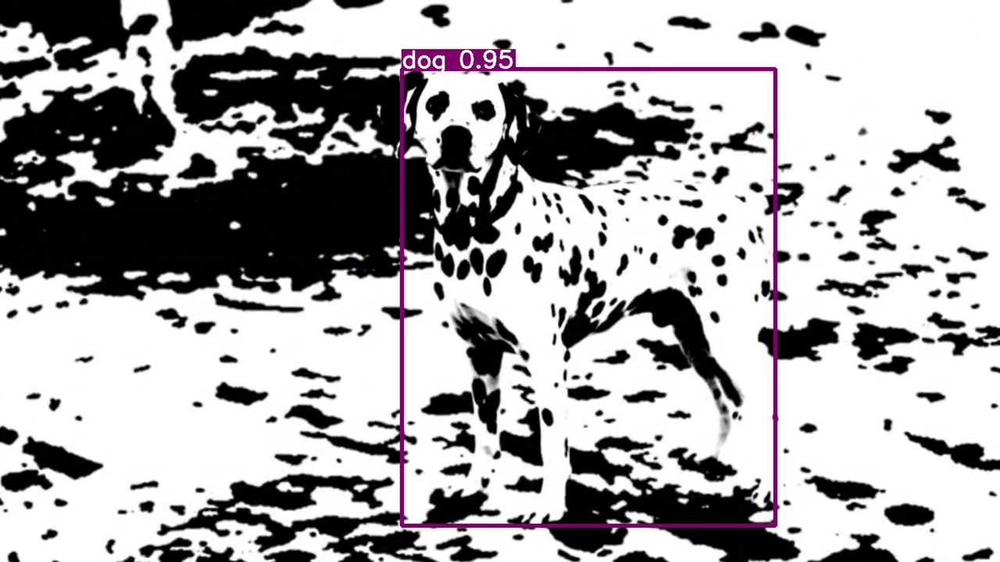

```python
# Install the Ultralytics package
!pip install ultralytics -q
import numpy as np
```

       ━━━━━━━━━━━━━━━━━━━━━━━━━━━━━━━━━━━━━━━━ 1.2/1.2 MB 15.1 MB/s eta 0:00:00
    [?25h


```python
from ultralytics import YOLO

# Load the extra-large YOLO26 model
# It will automatically download the weights if not present
model = YOLO('yolo11x.pt')

# Run detection on your uploaded video
# 'save=True' saves the resulting video with bounding boxes
results = model.predict(source='/content/Video_Generation_With_Static_Camera.mp4', save=True, conf=0.25)

print("Processing complete! Check the 'runs/detect/predict' folder for your video.")
```

    
    WARNING ⚠️ 
    Inference results will accumulate in RAM unless `stream=True` is passed, which can cause out-of-memory errors for large
    sources or long-running streams and videos. See https://docs.ultralytics.com/modes/predict/ for help.
    
    Example:
        results = model(source=..., stream=True)  # generator of Results objects
        for r in results:
            boxes = r.boxes  # Boxes object for bbox outputs
            masks = r.masks  # Masks object for segment masks outputs
            probs = r.probs  # Class probabilities for classification outputs
    
    video 1/1 (frame 1/192) /content/Video_Generation_With_Static_Camera.mp4: 640x384 (no detections), 2336.9ms
    video 1/1 (frame 2/192) /content/Video_Generation_With_Static_Camera.mp4: 640x384 (no detections), 2388.0ms
    video 1/1 (frame 3/192) /content/Video_Generation_With_Static_Camera.mp4: 640x384 (no detections), 2225.2ms
    video 1/1 (frame 4/192) /content/Video_Generation_With_Static_Camera.mp4: 640x384 (no detections), 3081.2ms
    video 1/1 (frame 5/192) /content/Video_Generation_With_Static_Camera.mp4: 640x384 (no detections), 3009.2ms
    video 1/1 (frame 6/192) /content/Video_Generation_With_Static_Camera.mp4: 640x384 (no detections), 2301.9ms
    video 1/1 (frame 7/192) /content/Video_Generation_With_Static_Camera.mp4: 640x384 (no detections), 2399.1ms
    video 1/1 (frame 8/192) /content/Video_Generation_With_Static_Camera.mp4: 640x384 (no detections), 2151.8ms
    video 1/1 (frame 9/192) /content/Video_Generation_With_Static_Camera.mp4: 640x384 1 bird, 2344.9ms
    video 1/1 (frame 10/192) /content/Video_Generation_With_Static_Camera.mp4: 640x384 (no detections), 3091.5ms
    video 1/1 (frame 11/192) /content/Video_Generation_With_Static_Camera.mp4: 640x384 1 bird, 2213.3ms
    video 1/1 (frame 12/192) /content/Video_Generation_With_Static_Camera.mp4: 640x384 (no detections), 2304.2ms
    video 1/1 (frame 13/192) /content/Video_Generation_With_Static_Camera.mp4: 640x384 (no detections), 2341.5ms
    video 1/1 (frame 14/192) /content/Video_Generation_With_Static_Camera.mp4: 640x384 (no detections), 2098.8ms
    video 1/1 (frame 15/192) /content/Video_Generation_With_Static_Camera.mp4: 640x384 (no detections), 2815.3ms
    video 1/1 (frame 16/192) /content/Video_Generation_With_Static_Camera.mp4: 640x384 (no detections), 2178.0ms
    video 1/1 (frame 17/192) /content/Video_Generation_With_Static_Camera.mp4: 640x384 (no detections), 2109.1ms
    video 1/1 (frame 18/192) /content/Video_Generation_With_Static_Camera.mp4: 640x384 (no detections), 2076.7ms
    video 1/1 (frame 19/192) /content/Video_Generation_With_Static_Camera.mp4: 640x384 (no detections), 2193.2ms
    video 1/1 (frame 20/192) /content/Video_Generation_With_Static_Camera.mp4: 640x384 (no detections), 2128.7ms
    video 1/1 (frame 21/192) /content/Video_Generation_With_Static_Camera.mp4: 640x384 1 bird, 2788.9ms
    video 1/1 (frame 22/192) /content/Video_Generation_With_Static_Camera.mp4: 640x384 1 bird, 2005.0ms
    video 1/1 (frame 23/192) /content/Video_Generation_With_Static_Camera.mp4: 640x384 1 bird, 1984.3ms
    video 1/1 (frame 24/192) /content/Video_Generation_With_Static_Camera.mp4: 640x384 1 bird, 1975.4ms
    video 1/1 (frame 25/192) /content/Video_Generation_With_Static_Camera.mp4: 640x384 1 bird, 1972.1ms
    video 1/1 (frame 26/192) /content/Video_Generation_With_Static_Camera.mp4: 640x384 1 bird, 2386.8ms
    video 1/1 (frame 27/192) /content/Video_Generation_With_Static_Camera.mp4: 640x384 (no detections), 2581.5ms
    video 1/1 (frame 28/192) /content/Video_Generation_With_Static_Camera.mp4: 640x384 (no detections), 2154.5ms
    video 1/1 (frame 29/192) /content/Video_Generation_With_Static_Camera.mp4: 640x384 (no detections), 2221.1ms
    video 1/1 (frame 30/192) /content/Video_Generation_With_Static_Camera.mp4: 640x384 (no detections), 2101.6ms
    video 1/1 (frame 31/192) /content/Video_Generation_With_Static_Camera.mp4: 640x384 (no detections), 2107.4ms
    video 1/1 (frame 32/192) /content/Video_Generation_With_Static_Camera.mp4: 640x384 (no detections), 2936.3ms
    video 1/1 (frame 33/192) /content/Video_Generation_With_Static_Camera.mp4: 640x384 (no detections), 2098.6ms
    video 1/1 (frame 34/192) /content/Video_Generation_With_Static_Camera.mp4: 640x384 (no detections), 2045.0ms
    video 1/1 (frame 35/192) /content/Video_Generation_With_Static_Camera.mp4: 640x384 (no detections), 2004.2ms
    video 1/1 (frame 36/192) /content/Video_Generation_With_Static_Camera.mp4: 640x384 (no detections), 1983.8ms
    video 1/1 (frame 37/192) /content/Video_Generation_With_Static_Camera.mp4: 640x384 (no detections), 2339.2ms
    video 1/1 (frame 38/192) /content/Video_Generation_With_Static_Camera.mp4: 640x384 (no detections), 2625.1ms
    video 1/1 (frame 39/192) /content/Video_Generation_With_Static_Camera.mp4: 640x384 (no detections), 1991.0ms
    video 1/1 (frame 40/192) /content/Video_Generation_With_Static_Camera.mp4: 640x384 (no detections), 2071.0ms
    video 1/1 (frame 41/192) /content/Video_Generation_With_Static_Camera.mp4: 640x384 1 bird, 2049.7ms
    video 1/1 (frame 42/192) /content/Video_Generation_With_Static_Camera.mp4: 640x384 1 bird, 2058.7ms
    video 1/1 (frame 43/192) /content/Video_Generation_With_Static_Camera.mp4: 640x384 1 bird, 3047.9ms
    video 1/1 (frame 44/192) /content/Video_Generation_With_Static_Camera.mp4: 640x384 (no detections), 2059.9ms
    video 1/1 (frame 45/192) /content/Video_Generation_With_Static_Camera.mp4: 640x384 1 bird, 2040.2ms
    video 1/1 (frame 46/192) /content/Video_Generation_With_Static_Camera.mp4: 640x384 1 bird, 2046.3ms
    video 1/1 (frame 47/192) /content/Video_Generation_With_Static_Camera.mp4: 640x384 1 bird, 2096.2ms
    video 1/1 (frame 48/192) /content/Video_Generation_With_Static_Camera.mp4: 640x384 1 bird, 2167.9ms
    video 1/1 (frame 49/192) /content/Video_Generation_With_Static_Camera.mp4: 640x384 1 bird, 2846.6ms
    video 1/1 (frame 50/192) /content/Video_Generation_With_Static_Camera.mp4: 640x384 1 bird, 2002.8ms
    video 1/1 (frame 51/192) /content/Video_Generation_With_Static_Camera.mp4: 640x384 1 bird, 1994.1ms
    video 1/1 (frame 52/192) /content/Video_Generation_With_Static_Camera.mp4: 640x384 1 bird, 2088.7ms
    video 1/1 (frame 53/192) /content/Video_Generation_With_Static_Camera.mp4: 640x384 1 bird, 2082.1ms
    video 1/1 (frame 54/192) /content/Video_Generation_With_Static_Camera.mp4: 640x384 1 bird, 2627.3ms
    video 1/1 (frame 55/192) /content/Video_Generation_With_Static_Camera.mp4: 640x384 1 bird, 2300.8ms
    video 1/1 (frame 56/192) /content/Video_Generation_With_Static_Camera.mp4: 640x384 1 bird, 2316.0ms
    video 1/1 (frame 57/192) /content/Video_Generation_With_Static_Camera.mp4: 640x384 1 bird, 2196.6ms
    video 1/1 (frame 58/192) /content/Video_Generation_With_Static_Camera.mp4: 640x384 1 bird, 2083.2ms
    video 1/1 (frame 59/192) /content/Video_Generation_With_Static_Camera.mp4: 640x384 1 bird, 2523.0ms
    video 1/1 (frame 60/192) /content/Video_Generation_With_Static_Camera.mp4: 640x384 1 bird, 2673.0ms
    video 1/1 (frame 61/192) /content/Video_Generation_With_Static_Camera.mp4: 640x384 1 bird, 1 teddy bear, 2156.7ms
    video 1/1 (frame 62/192) /content/Video_Generation_With_Static_Camera.mp4: 640x384 1 bird, 2021.4ms
    video 1/1 (frame 63/192) /content/Video_Generation_With_Static_Camera.mp4: 640x384 1 bird, 2178.1ms
    video 1/1 (frame 64/192) /content/Video_Generation_With_Static_Camera.mp4: 640x384 1 bird, 1998.3ms
    video 1/1 (frame 65/192) /content/Video_Generation_With_Static_Camera.mp4: 640x384 1 bird, 2903.0ms
    video 1/1 (frame 66/192) /content/Video_Generation_With_Static_Camera.mp4: 640x384 1 bird, 2046.9ms
    video 1/1 (frame 67/192) /content/Video_Generation_With_Static_Camera.mp4: 640x384 1 bird, 1994.7ms
    video 1/1 (frame 68/192) /content/Video_Generation_With_Static_Camera.mp4: 640x384 1 bird, 2002.5ms
    video 1/1 (frame 69/192) /content/Video_Generation_With_Static_Camera.mp4: 640x384 1 bird, 2034.0ms
    video 1/1 (frame 70/192) /content/Video_Generation_With_Static_Camera.mp4: 640x384 1 bird, 1974.6ms
    video 1/1 (frame 71/192) /content/Video_Generation_With_Static_Camera.mp4: 640x384 1 bird, 2874.3ms
    video 1/1 (frame 72/192) /content/Video_Generation_With_Static_Camera.mp4: 640x384 1 bird, 2021.1ms
    video 1/1 (frame 73/192) /content/Video_Generation_With_Static_Camera.mp4: 640x384 1 bird, 2193.1ms
    video 1/1 (frame 74/192) /content/Video_Generation_With_Static_Camera.mp4: 640x384 1 bird, 2157.0ms
    video 1/1 (frame 75/192) /content/Video_Generation_With_Static_Camera.mp4: 640x384 1 bird, 2072.9ms
    video 1/1 (frame 76/192) /content/Video_Generation_With_Static_Camera.mp4: 640x384 1 bird, 2569.0ms
    video 1/1 (frame 77/192) /content/Video_Generation_With_Static_Camera.mp4: 640x384 1 bird, 2367.3ms
    video 1/1 (frame 78/192) /content/Video_Generation_With_Static_Camera.mp4: 640x384 1 bird, 2091.4ms
    video 1/1 (frame 79/192) /content/Video_Generation_With_Static_Camera.mp4: 640x384 1 bird, 2122.2ms
    video 1/1 (frame 80/192) /content/Video_Generation_With_Static_Camera.mp4: 640x384 1 bird, 1996.7ms
    video 1/1 (frame 81/192) /content/Video_Generation_With_Static_Camera.mp4: 640x384 1 bird, 2068.3ms
    video 1/1 (frame 82/192) /content/Video_Generation_With_Static_Camera.mp4: 640x384 1 bird, 2905.0ms
    video 1/1 (frame 83/192) /content/Video_Generation_With_Static_Camera.mp4: 640x384 1 bird, 2027.9ms
    video 1/1 (frame 84/192) /content/Video_Generation_With_Static_Camera.mp4: 640x384 1 bird, 2003.1ms
    video 1/1 (frame 85/192) /content/Video_Generation_With_Static_Camera.mp4: 640x384 1 bird, 2049.8ms
    video 1/1 (frame 86/192) /content/Video_Generation_With_Static_Camera.mp4: 640x384 1 bird, 1989.8ms
    video 1/1 (frame 87/192) /content/Video_Generation_With_Static_Camera.mp4: 640x384 1 bird, 2421.6ms
    video 1/1 (frame 88/192) /content/Video_Generation_With_Static_Camera.mp4: 640x384 1 bird, 2603.2ms
    video 1/1 (frame 89/192) /content/Video_Generation_With_Static_Camera.mp4: 640x384 1 bird, 1994.9ms
    video 1/1 (frame 90/192) /content/Video_Generation_With_Static_Camera.mp4: 640x384 2 birds, 2051.8ms
    video 1/1 (frame 91/192) /content/Video_Generation_With_Static_Camera.mp4: 640x384 2 birds, 2046.6ms
    video 1/1 (frame 92/192) /content/Video_Generation_With_Static_Camera.mp4: 640x384 1 bird, 2109.2ms
    video 1/1 (frame 93/192) /content/Video_Generation_With_Static_Camera.mp4: 640x384 1 bird, 2804.9ms
    video 1/1 (frame 94/192) /content/Video_Generation_With_Static_Camera.mp4: 640x384 1 bird, 2248.7ms
    video 1/1 (frame 95/192) /content/Video_Generation_With_Static_Camera.mp4: 640x384 1 bird, 2020.9ms
    video 1/1 (frame 96/192) /content/Video_Generation_With_Static_Camera.mp4: 640x384 1 bird, 2017.3ms
    video 1/1 (frame 97/192) /content/Video_Generation_With_Static_Camera.mp4: 640x384 (no detections), 1996.8ms
    video 1/1 (frame 98/192) /content/Video_Generation_With_Static_Camera.mp4: 640x384 (no detections), 2016.0ms
    video 1/1 (frame 99/192) /content/Video_Generation_With_Static_Camera.mp4: 640x384 (no detections), 2961.5ms
    video 1/1 (frame 100/192) /content/Video_Generation_With_Static_Camera.mp4: 640x384 (no detections), 2002.0ms
    video 1/1 (frame 101/192) /content/Video_Generation_With_Static_Camera.mp4: 640x384 (no detections), 1987.3ms
    video 1/1 (frame 102/192) /content/Video_Generation_With_Static_Camera.mp4: 640x384 1 bird, 2015.3ms
    video 1/1 (frame 103/192) /content/Video_Generation_With_Static_Camera.mp4: 640x384 1 bird, 2069.7ms
    video 1/1 (frame 104/192) /content/Video_Generation_With_Static_Camera.mp4: 640x384 1 bird, 2346.3ms
    video 1/1 (frame 105/192) /content/Video_Generation_With_Static_Camera.mp4: 640x384 1 bird, 2547.9ms
    video 1/1 (frame 106/192) /content/Video_Generation_With_Static_Camera.mp4: 640x384 1 bird, 2072.5ms
    video 1/1 (frame 107/192) /content/Video_Generation_With_Static_Camera.mp4: 640x384 1 bird, 2014.6ms
    video 1/1 (frame 108/192) /content/Video_Generation_With_Static_Camera.mp4: 640x384 1 bird, 2033.3ms
    video 1/1 (frame 109/192) /content/Video_Generation_With_Static_Camera.mp4: 640x384 1 bird, 1994.8ms
    video 1/1 (frame 110/192) /content/Video_Generation_With_Static_Camera.mp4: 640x384 1 bird, 2657.1ms
    video 1/1 (frame 111/192) /content/Video_Generation_With_Static_Camera.mp4: 640x384 2 birds, 2196.7ms
    video 1/1 (frame 112/192) /content/Video_Generation_With_Static_Camera.mp4: 640x384 1 bird, 1983.5ms
    video 1/1 (frame 113/192) /content/Video_Generation_With_Static_Camera.mp4: 640x384 1 bird, 2043.2ms
    video 1/1 (frame 114/192) /content/Video_Generation_With_Static_Camera.mp4: 640x384 1 bird, 2042.4ms
    video 1/1 (frame 115/192) /content/Video_Generation_With_Static_Camera.mp4: 640x384 1 bird, 2008.4ms
    video 1/1 (frame 116/192) /content/Video_Generation_With_Static_Camera.mp4: 640x384 1 bird, 2971.6ms
    video 1/1 (frame 117/192) /content/Video_Generation_With_Static_Camera.mp4: 640x384 1 bird, 2033.5ms
    video 1/1 (frame 118/192) /content/Video_Generation_With_Static_Camera.mp4: 640x384 1 bird, 1968.6ms
    video 1/1 (frame 119/192) /content/Video_Generation_With_Static_Camera.mp4: 640x384 1 bird, 2007.7ms
    video 1/1 (frame 120/192) /content/Video_Generation_With_Static_Camera.mp4: 640x384 1 bird, 2003.1ms
    video 1/1 (frame 121/192) /content/Video_Generation_With_Static_Camera.mp4: 640x384 1 bird, 2180.9ms
    video 1/1 (frame 122/192) /content/Video_Generation_With_Static_Camera.mp4: 640x384 1 bird, 2758.0ms
    video 1/1 (frame 123/192) /content/Video_Generation_With_Static_Camera.mp4: 640x384 1 bird, 1999.1ms
    video 1/1 (frame 124/192) /content/Video_Generation_With_Static_Camera.mp4: 640x384 1 bird, 2029.5ms
    video 1/1 (frame 125/192) /content/Video_Generation_With_Static_Camera.mp4: 640x384 1 bird, 1985.6ms
    video 1/1 (frame 126/192) /content/Video_Generation_With_Static_Camera.mp4: 640x384 1 bird, 2010.3ms
    video 1/1 (frame 127/192) /content/Video_Generation_With_Static_Camera.mp4: 640x384 1 bird, 2587.5ms
    video 1/1 (frame 128/192) /content/Video_Generation_With_Static_Camera.mp4: 640x384 1 bird, 2471.5ms
    video 1/1 (frame 129/192) /content/Video_Generation_With_Static_Camera.mp4: 640x384 1 bird, 2087.2ms
    video 1/1 (frame 130/192) /content/Video_Generation_With_Static_Camera.mp4: 640x384 1 bird, 2018.9ms
    video 1/1 (frame 131/192) /content/Video_Generation_With_Static_Camera.mp4: 640x384 1 bird, 2018.0ms
    video 1/1 (frame 132/192) /content/Video_Generation_With_Static_Camera.mp4: 640x384 1 bird, 2001.2ms
    video 1/1 (frame 133/192) /content/Video_Generation_With_Static_Camera.mp4: 640x384 1 bird, 2953.6ms
    video 1/1 (frame 134/192) /content/Video_Generation_With_Static_Camera.mp4: 640x384 1 bird, 2037.6ms
    video 1/1 (frame 135/192) /content/Video_Generation_With_Static_Camera.mp4: 640x384 1 bird, 2029.0ms
    video 1/1 (frame 136/192) /content/Video_Generation_With_Static_Camera.mp4: 640x384 1 bird, 2022.8ms
    video 1/1 (frame 137/192) /content/Video_Generation_With_Static_Camera.mp4: 640x384 1 bird, 2076.4ms
    video 1/1 (frame 138/192) /content/Video_Generation_With_Static_Camera.mp4: 640x384 1 bird, 2267.6ms
    video 1/1 (frame 139/192) /content/Video_Generation_With_Static_Camera.mp4: 640x384 1 bird, 2725.8ms
    video 1/1 (frame 140/192) /content/Video_Generation_With_Static_Camera.mp4: 640x384 1 bird, 2000.8ms
    video 1/1 (frame 141/192) /content/Video_Generation_With_Static_Camera.mp4: 640x384 1 bird, 2004.5ms
    video 1/1 (frame 142/192) /content/Video_Generation_With_Static_Camera.mp4: 640x384 1 bird, 2049.0ms
    video 1/1 (frame 143/192) /content/Video_Generation_With_Static_Camera.mp4: 640x384 1 bird, 2065.6ms
    video 1/1 (frame 144/192) /content/Video_Generation_With_Static_Camera.mp4: 640x384 1 bird, 2645.5ms
    video 1/1 (frame 145/192) /content/Video_Generation_With_Static_Camera.mp4: 640x384 1 bird, 2250.6ms
    video 1/1 (frame 146/192) /content/Video_Generation_With_Static_Camera.mp4: 640x384 1 bird, 2008.4ms
    video 1/1 (frame 147/192) /content/Video_Generation_With_Static_Camera.mp4: 640x384 1 bird, 2009.9ms
    video 1/1 (frame 148/192) /content/Video_Generation_With_Static_Camera.mp4: 640x384 1 bird, 2001.9ms
    video 1/1 (frame 149/192) /content/Video_Generation_With_Static_Camera.mp4: 640x384 1 bird, 2032.6ms
    video 1/1 (frame 150/192) /content/Video_Generation_With_Static_Camera.mp4: 640x384 1 bird, 2977.2ms
    video 1/1 (frame 151/192) /content/Video_Generation_With_Static_Camera.mp4: 640x384 1 bird, 2024.2ms
    video 1/1 (frame 152/192) /content/Video_Generation_With_Static_Camera.mp4: 640x384 1 bird, 2049.7ms
    video 1/1 (frame 153/192) /content/Video_Generation_With_Static_Camera.mp4: 640x384 1 bird, 2057.3ms
    video 1/1 (frame 154/192) /content/Video_Generation_With_Static_Camera.mp4: 640x384 1 bird, 2001.5ms
    video 1/1 (frame 155/192) /content/Video_Generation_With_Static_Camera.mp4: 640x384 1 bird, 2372.6ms
    video 1/1 (frame 156/192) /content/Video_Generation_With_Static_Camera.mp4: 640x384 1 bird, 2593.0ms
    video 1/1 (frame 157/192) /content/Video_Generation_With_Static_Camera.mp4: 640x384 1 bird, 2074.1ms
    video 1/1 (frame 158/192) /content/Video_Generation_With_Static_Camera.mp4: 640x384 1 bird, 1999.9ms
    video 1/1 (frame 159/192) /content/Video_Generation_With_Static_Camera.mp4: 640x384 1 bird, 1985.3ms
    video 1/1 (frame 160/192) /content/Video_Generation_With_Static_Camera.mp4: 640x384 1 bird, 1962.9ms
    video 1/1 (frame 161/192) /content/Video_Generation_With_Static_Camera.mp4: 640x384 1 bird, 2686.6ms
    video 1/1 (frame 162/192) /content/Video_Generation_With_Static_Camera.mp4: 640x384 1 bird, 2148.4ms
    video 1/1 (frame 163/192) /content/Video_Generation_With_Static_Camera.mp4: 640x384 1 bird, 2036.3ms
    video 1/1 (frame 164/192) /content/Video_Generation_With_Static_Camera.mp4: 640x384 1 bird, 2039.5ms
    video 1/1 (frame 165/192) /content/Video_Generation_With_Static_Camera.mp4: 640x384 1 bird, 2007.4ms
    video 1/1 (frame 166/192) /content/Video_Generation_With_Static_Camera.mp4: 640x384 1 bird, 2004.1ms
    video 1/1 (frame 167/192) /content/Video_Generation_With_Static_Camera.mp4: 640x384 1 bird, 2924.4ms
    video 1/1 (frame 168/192) /content/Video_Generation_With_Static_Camera.mp4: 640x384 1 bird, 2064.3ms
    video 1/1 (frame 169/192) /content/Video_Generation_With_Static_Camera.mp4: 640x384 1 bird, 2054.2ms
    video 1/1 (frame 170/192) /content/Video_Generation_With_Static_Camera.mp4: 640x384 1 bird, 2061.6ms
    video 1/1 (frame 171/192) /content/Video_Generation_With_Static_Camera.mp4: 640x384 1 bird, 2076.1ms
    video 1/1 (frame 172/192) /content/Video_Generation_With_Static_Camera.mp4: 640x384 1 bird, 2454.3ms
    video 1/1 (frame 173/192) /content/Video_Generation_With_Static_Camera.mp4: 640x384 1 bird, 2463.7ms
    video 1/1 (frame 174/192) /content/Video_Generation_With_Static_Camera.mp4: 640x384 1 bird, 2014.3ms
    video 1/1 (frame 175/192) /content/Video_Generation_With_Static_Camera.mp4: 640x384 1 bird, 1981.0ms
    video 1/1 (frame 176/192) /content/Video_Generation_With_Static_Camera.mp4: 640x384 1 bird, 1987.5ms
    video 1/1 (frame 177/192) /content/Video_Generation_With_Static_Camera.mp4: 640x384 1 bird, 2089.2ms
    video 1/1 (frame 178/192) /content/Video_Generation_With_Static_Camera.mp4: 640x384 1 bird, 2848.0ms
    video 1/1 (frame 179/192) /content/Video_Generation_With_Static_Camera.mp4: 640x384 1 bird, 2101.3ms
    video 1/1 (frame 180/192) /content/Video_Generation_With_Static_Camera.mp4: 640x384 1 bird, 1994.5ms
    video 1/1 (frame 181/192) /content/Video_Generation_With_Static_Camera.mp4: 640x384 1 bird, 1985.4ms
    video 1/1 (frame 182/192) /content/Video_Generation_With_Static_Camera.mp4: 640x384 1 bird, 2027.5ms
    video 1/1 (frame 183/192) /content/Video_Generation_With_Static_Camera.mp4: 640x384 1 bird, 2015.0ms
    video 1/1 (frame 184/192) /content/Video_Generation_With_Static_Camera.mp4: 640x384 1 bird, 2910.0ms
    video 1/1 (frame 185/192) /content/Video_Generation_With_Static_Camera.mp4: 640x384 1 bird, 1998.6ms
    video 1/1 (frame 186/192) /content/Video_Generation_With_Static_Camera.mp4: 640x384 1 bird, 2064.7ms
    video 1/1 (frame 187/192) /content/Video_Generation_With_Static_Camera.mp4: 640x384 1 bird, 2062.6ms
    video 1/1 (frame 188/192) /content/Video_Generation_With_Static_Camera.mp4: 640x384 1 bird, 2017.2ms
    video 1/1 (frame 189/192) /content/Video_Generation_With_Static_Camera.mp4: 640x384 1 bird, 2390.4ms
    video 1/1 (frame 190/192) /content/Video_Generation_With_Static_Camera.mp4: 640x384 1 bird, 2543.4ms
    video 1/1 (frame 191/192) /content/Video_Generation_With_Static_Camera.mp4: 640x384 1 bird, 2027.6ms
    video 1/1 (frame 192/192) /content/Video_Generation_With_Static_Camera.mp4: 640x384 1 bird, 2135.5ms
    Speed: 3.5ms preprocess, 2219.9ms inference, 1.2ms postprocess per image at shape (1, 3, 640, 384)
    Results saved to /content/runs/detect/predict2
    Processing complete! Check the 'runs/detect/predict' folder for your video.
    


```python
best_classes = []
best_prob = 0
best_result = 0
for result in results:

    probs = 0
    classes = []
    if result.boxes:
        # Iterate through every detected box in the frame
        for box in result.boxes:
            # Get the confidence score (probability)
            confidence = box.conf.item()
            if confidence > 0.7:
              probs += confidence

              # Get the class ID (label)
              class_id = int(box.cls.item())
              classes.append(class_id)
              # print(f"Object: {class_id} | Confidence: {confidence:.2f}")

    if probs > best_prob:

            best_result = result
            best_prob = probs
            best_classes = np.array(classes)
```


```python
if np.unique(best_classes).shape[0] == 1:
  if len(best_classes) > 1:
    print(f"Objects found in the image: {len(best_classes)} {results[0].names[best_classes[0]]}s")
  else:
    print(f"Object found in the image: {results[0].names[best_classes[0]]}")
else:
  for obj in best_classes:
    print(f"Object found in the image: {results[0].names[obj]}")
```

    Object found in the image: bird
    


```python
best_result.show()
```


    

    


```python
if np.unique(best_classes).shape[0] == 1:
  if len(best_classes) > 1:
    print(f"Objects found in the image: {len(best_classes)} {results[0].names[best_classes[0]]}s")
  else:
    print(f"Object found in the image: {results[0].names[best_classes[0]]}")
else:
  for obj in best_classes:
    print(f"Object found in the image: {results[0].names[obj]}")
```

    Objects found in the image: 3 horses
    


```python
best_result.show()
```


    

    


```python
if np.unique(best_classes).shape[0] == 1:
  if len(best_classes) > 1:
    print(f"Objects found in the image: {len(best_classes)} {results[0].names[best_classes[0]]}s")
  else:
    print(f"Object found in the image: {results[0].names[best_classes[0]]}")
else:
  for obj in best_classes:
    print(f"Object found in the image: {results[0].names[obj]}")
```

    Object found in the image: dog
    


```python
best_result.show()
```


    

    

